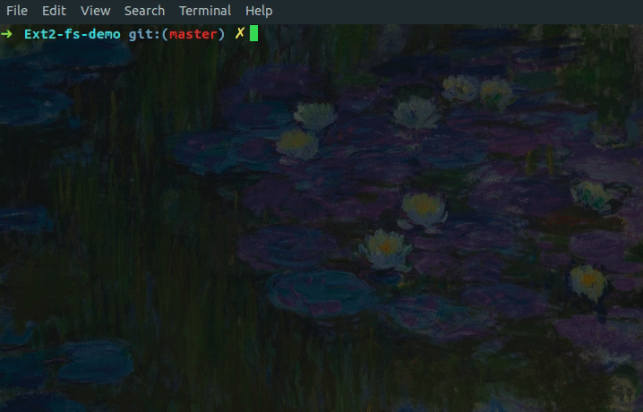
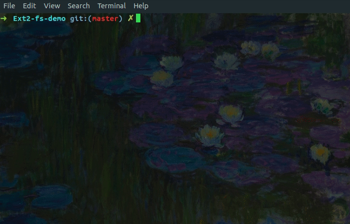

# Ext2-fs-demo
This is a demonstration on how to use the tools I implemented for an Ext2 file system.

## Step 1.
Build the project and produce executables by calling `make`.

<!--  -->

---
## Step 2.
Run `demo1.sh` which will visualize en empty disk.

---
## Step 3.
Run `demo2.sh` to see the demo of `ext2_cp` which copies a local source file named `file.txt` to the disk.

